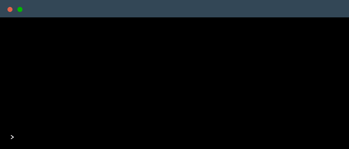

# weather-cli

Retrieve weather information directly from your terminal.




# Install
via `npm`
```
npm install -g @suptower/weather-cli
```

# Usage
```
Usage: 
        $ weather [options]
        $ weather [location]
        $ weather [options] [location]

    Options:
        -h, --help              output usage information
        -v, --version           output the version number
        -a, --api               set api key
        -c, --config            show config
        -d, --delete_config     clear config
        -e, --env               set api key from environment variable API_KEY
        -f , --fast [loc]       fast mode, no prompt, location as arg
        -t, --three_day [loc]   show three day forecast
        -i, --info              show project related info

    Examples:
        $ weather Munich
        $ weather --api
        $ weather -v
        $ weather --config
        $ weather --info
        $ weather -f Munich
        $ weather -t Munich
        $ weather
```

# API Key
The used API is [Weather API](https://www.weatherapi.com) (free). A registration is needed to retrieve the API key.

You have two ways to specifiy your key.

## 1. API Key via .env
Create a `.env` file in the repository and paste the following:
```
API_KEY="<your-api-key-goes-here>"
```
Then execute following command:
```
weather -e
# output
API key from dotenv has been set.
```

## 2. API Key via terminal
Enter following command:
```
weather -a
# output
? Enter your API key » <your-api-key-goes-here>
```

# Fast Mode
If you want to retrieve the weather information directly without any prompt, you can use the fast mode.
```
weather -f Munich
# output
The weather in Munich is currently Partly cloudy with a temperature of 8.0°C.
```

# Config
You can show the current config with following command:
```
weather -c
```
The config allows you to change the temperature unit, the forecast hour traversing style, the favorite location and the default action for blank command.
```
weather -c
# output
? Select config option » - Use arrow-keys. Return to submit.
    Show API key
    Delete API key
>   Set temperature unit
    Set forecast hour traversing style
    Preset Times Configuration
    Set favorite location
    Set default action for blank command
    Reset config
    Cancel
    ---
? Select temperature unit » - Use arrow-keys. Return to submit.
>   Celsius
    Fahrenheit
    ---
    √ Select temperature unit » Celsius
    ---
Temperature unit is saved as metric.
```

## Temperature unit
The two options for temperature unit are Celsius (metric) and Fahrenheit (imperial). Every temperature will be converted to the selected unit when displayed.
You can change the temperature unit in the config (`weather -c`). The default unit is Celsius.

## Forecast hour traversing style
When checking forecast information, you can choose between two hour traversing styles. The default one (dial) lets you cycle the forecast for each hour individually (0-23) when accessing a forecast. The other style (preset) lets you configure a list of preset times which will be used to check the forecast. You can change the hour traversing style in the config (`weather -c`). The default style is dial. The default preset options are Morning (6 AM), Noon (12 PM), Evening (6 PM) and Night (12 AM). You are also able to configure these presets in the configuration.
For example:
```
weather -c
# output
? Select config option » - Use arrow-keys. Return to submit.
    Show API key
    Delete API key
    Set temperature unit
    Set forecast hour traversing style
>   Preset Times Configuration
    Set favorite location
    Set default action for blank command
    Reset config
    Cancel
    ---
? Choose an option » - Use arrow-keys. Return to submit.
>   Add preset time
    Edit preset time
    Remove preset times
    Show preset times
    Reset preset times
    Cancel
    ---
    ? Enter a preset name » Afternoon
    ---
    √ Enter a preset name ... Afternoon
    ? Enter a preset time » 16
    Preset time added.
```
You can also show the preset times like this:
```
weather -c
# output
√ Select config option » Preset Times Configuration     
? Choose an option » - Use arrow-keys. Return to submit.
    Add preset time
    Edit preset time
    Remove preset times
>   Show preset times
    Reset preset times
    Cancel
    ---
    √ Choose an option » Show preset times
    ╔═══════════╤══════╗
    ║ Name      │ Time ║
    ╟───────────┼──────╢
    ║ Night     │ 0    ║
    ╟───────────┼──────╢
    ║ Morning   │ 6    ║
    ╟───────────┼──────╢
    ║ Noon      │ 12   ║
    ╟───────────┼──────╢
    ║ Afternoon │ 16   ║
    ╟───────────┼──────╢
    ║ Evening   │ 18   ║
    ╚═══════════╧══════╝
```
You are also able to edit and remove existing preset times as well as resetting them to their default state.

## Favorite location
You can set a favorite location in the config (`weather -c`). This location will be used when you don't specify a location in the command. The default location is Munich.

## Default action for blank command
You can set a default action for the blank command (`weather`) in the config (`weather -c`). The default action is to show a three day forecast for the favorite location.
However, you can set the default action to show the full prompt menu for the favorite location instead.